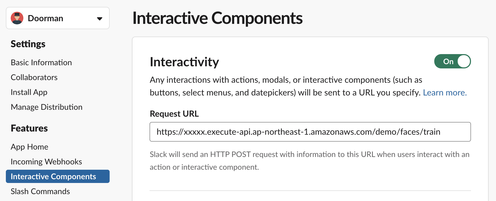

# Slack App

https://api.slack.com/apps 로 이동 합니다.

## Create New App

`Create New App` 을 눌러 새 앱을 만듭니다.

## Incoming Webhooks

Incoming Webhooks 을 활성화 합니다.

## Interactive Components

Interactive Components 을 활성화 합니다.

나중에 [deeplens-doorman-backend](https://github.com/nalbam/deeplens-doorman-backend) 을 생성하여 업데이트 합니다.

## OAuth & Permissions

OAuth Access Token 을 잘 저장해 둡니다.

나중에 [deeplens-doorman-backend](https://github.com/nalbam/deeplens-doorman-backend) 을 생성할 때 필요합니다.

Bot 의 권한을 선택 합니다.

* channels:join
* channels:read
* chat:write
* incoming-webhook
* users:read

